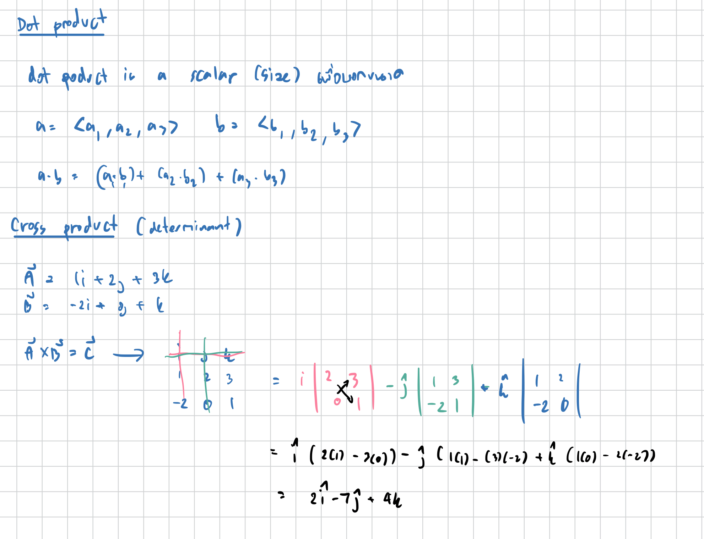
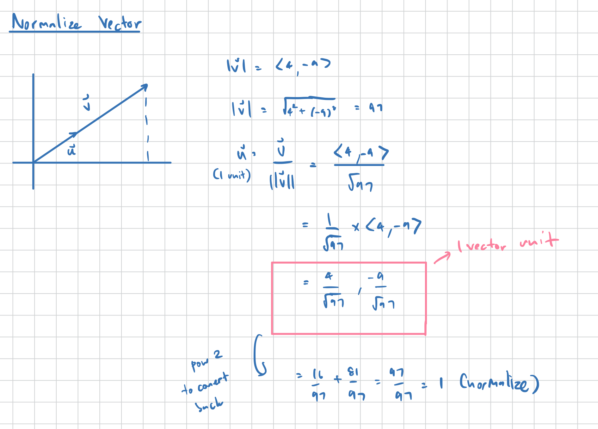
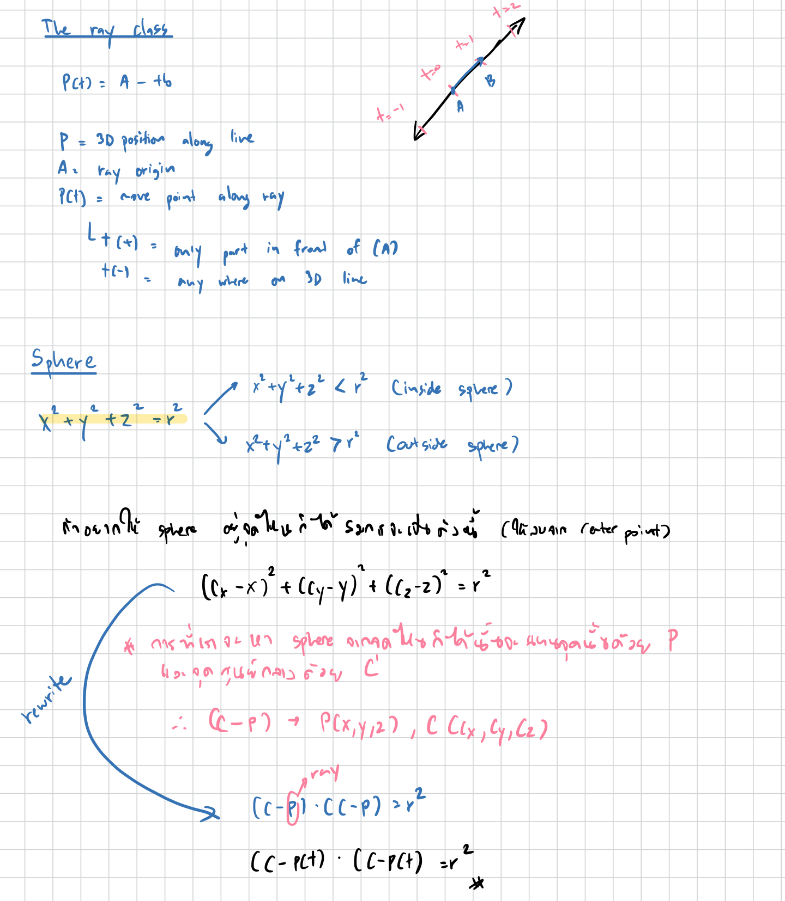
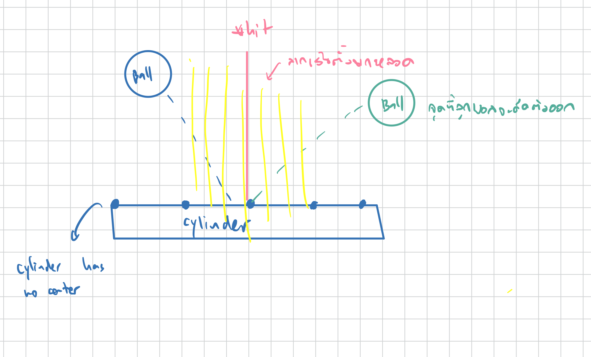

# miniRT

## Ray Tracing Basic

### Core Concept

For each pixel on the screen:
1. **Cast a ray** from the camera through the pixel
2. **Find intersections** with objects in the scene
3. **Calculate lighting** at the intersection point
4. **Determine the pixel color** based on material and lighting

---

## Project Overview

- **Objects**: Sphere, Plane, Cylinder
- **Lighting**: Ambient + Diffuse lighting
- **Input**: Scene description file (.rt format)
- **Output**: Rendered image in a window

## Mathematical Fundamentals

```c
typedef struct s_vec {
    float x, y, z;
} t_vec;
```

### Vector Operations

**Dot Product** - Measures Direction:
```
a · b = ax*bx + ay*by + az*bz
```
- Result > 0: vectors point in similar directions
- Result = 0: vectors are perpendicular
- Result < 0: vectors point in opposite directions

**Cross Product** - Creates a vector perpendicular to both input vectors:
```
a × b = (ay*bz - az*by, az*bx - ax*bz, ax*by - ay*bx)
```



**Vector Length** - Distance from origin:
```
|v| = √(x² + y² + z²)
```

**Normalization** - Creates a unit vector (length = 1):
```
normalized_v = v / |v|
```


### Ray Mathematics

#### Ray Definition
A ray is defined by:
- **Origin**: Starting point
- **Direction**: Normalized vector indicating direction
- **Parameter t**: Distance along the ray

```
Ray(t) = Origin + t * Direction
```

## Implementation

1. **MLX42 (graphics library)**
   - Initialize window and image buffer
   - Implement basic pixel drawing

2. **Implement vector mathematics**
   - Vector addition, subtraction, multiplication
   - Dot product, cross product, normalization
   - Vector length calculation

3. **Create basic ray tracing**
   - Generate rays from camera through pixels
   - Implement camera model with field of view

### **Sphere intersection**
   - Handle ray-sphere intersection math



- **Solve using quadratic formula**:
   ```
   t = (-b ± √(b² - 4ac)) / 2a
   ```

- **Handle solutions**:
   - No solutions (discriminant < 0): No intersection
   - One solution: Ray is tangent to sphere
   - Two solutions: Ray passes through sphere


```c
bool	sp_intersect(t_vec origin, t_vec direction, t_sphere *shape, float *t)
{
	t_vec	oc;
	t_vec	temp;
	float	t0;
	float	t1;
	float	discriminant;

	oc = vec3_sub(origin, shape->origin);
	temp.x = vec3_dot(direction, direction);
	temp.y = 2.0f * vec3_dot(oc, direction);
	temp.z = vec3_dot(oc, oc) - (shape->radius * shape->radius);
	discriminant = (temp.y * temp.y) - (4 * temp.x * temp.z);
	if (discriminant < 0)
		return (false);
	temp.z = sqrtf(discriminant);
	t0 = (-temp.y - temp.z) / (2.0f * temp.x);
	t1 = (-temp.y + temp.z) / (2.0f * temp.x);
	return (intersect_sphere(t0, t1, t));
}
```
### **Plane intersection**

```c
bool	pl_intersect(t_vec ori, t_vec direction, t_plane *plane, float *t)
{
	t_vec	normal;
	t_vec	temp_vector;
	float	denominator;

	normal = vec3_normalize(plane->normal);
	denominator = vec3_dot(direction, normal);
	if (fabsf(denominator) < 1e-6f)
		return (false);
	temp_vector = vec3_sub(plane->origin, ori);
	denominator = vec3_dot(temp_vector, normal) / denominator;
	if (denominator < 0)
		return (false);
	*t = denominator;
	return (true);
}
```

### **Cylinder Intersection**
- A cylinder is defined by:
- **Center**: Point C on the cylinder axis
- **Axis**: Direction vector A (normalized)
- **Radius**: Scalar r
- **Height**: Scalar h

|(P - C) - ((P - C)·A)A|² = r² สมการนี้คือ จุดไหนที่ห่างจากแกนกลางเป็นระยะ r = อยู่บนผิวทรงกระบอก

P = จุดใดๆ บนผิวทรงกระบอก
C = จุดศูนย์กลางของทรงกระบอก (บนแกน)
A = เวกเตอร์หน่วยของแกนทรงกระบอก
r = รัศมีของทรงกระบอก
· = (dot product)
| | = ขนาดของเวกเตอร์

- (P - C) - เวกเตอร์จากจุดศูนย์กลางไปยังจุด P
- ((P - C)·A)A - การฉายเวกเตอร์ (P - C) ลงบนแกน A = ส่วนประกอบที่ขนานกับแกน
- (P - C) - ((P - C)·A)A - เอาเวกเตอร์เต็ม - ส่วนที่ขนานกับแกน = ส่วนประกอบที่ตั้งฉากกับแกน

```c
- Full version explaination
```c
//คำนวณจุดตัดสองจุดเมื่อแสงชนทรงกระบอก 
static void	calculate_intersection_points(t_intersection_coef *coef)
{
	float	sqrt_discriminant;

	sqrt_discriminant = sqrtf(coef->discriminant);
	*(coef->t1) = (-coef->b - sqrt_discriminant) / (2.0f * coef->a);
	*(coef->t2) = (-coef->b + sqrt_discriminant) / (2.0f * coef->a);
}
//จัดการแสงขนาน
static bool	handle_parallel_ray(t_parallel_ray *ray, float *t)
{
	t_vec	hit_point;

	if (ray->c > 0)
		return (false);
	hit_point = vec3_add(ray->cam_origin, vec3_mul(ray->direction, 0.001f));
	if (is_within_height_bounds(hit_point, ray->cylin))
	{
		// ฉายจุดลงบนแกนทรงกระบอก
   	 	// เช็คว่าการฉายอยู่ในช่วง [0, ความสูง] หรือไม่
    	// return true ถ้าอยู่ในขอบเขต
		*t = 0.001f;
		return (true);
	}
	//จัดการกรณีพิเศษที่แสงขนานกับแกนของทรงกระบอก (เมื่อค่าสัมประสิทธิ์ 'a' ใกล้ศูนย์)
	return (false);
}
// คำนวณค่าสัมประสิทธิ์ (a, b, c) สำหรับสมการกำลังสองที่กำหนดการตัดกันของแสงกับทรงกระบอก
static void	calculate_cylinder_coefficients(t_cylinder_coef *coef,
	t_coeef *coeef)
{
	t_vec	d_perp;
	t_vec	oc_perp;

	//ตั้งฉากของทิศทางแสงและเวกเตอร์จากจุดเริ่มต้นไปยังจุดศูนย์กลาง
	d_perp = vec3_sub(coef->direction,
			vec3_mul(coef->axis, vec3_dot(coef->direction, coef->axis)));
	oc_perp = vec3_sub(coef->oc,
			vec3_mul(coef->axis, vec3_dot(coef->oc, coef->axis)));
	coeef->a = vec3_dot(d_perp, d_perp);
	coeef->b = 2.0f * vec3_dot(oc_perp, d_perp);
	coeef->c = vec3_dot(oc_perp, oc_perp) - (coef->radius * coef->radius);
}
//กำหนดว่าแสงตัดกับทรงกระบอกหรือไม่ และคืนค่าระยะห่างของจุดตัด
bool	cylin_intersect(t_vec cam_origin, t_vec direction,
	t_cylinder *cylin, float *t)
{
	t_cylinder_calc		calc;
	t_cylinder_coef		cyl_coef;
	t_parallel_ray		ray;
	t_intersection_coef	int_coef;
	t_intersection_data	data;

	calc.oc = vec3_sub(cam_origin, cylin->origin);
	cyl_coef = (t_cylinder_coef){direction, calc.oc,
		vec3_normalize(cylin->normal), cylin->diameter / 2.0f};
	calculate_cylinder_coefficients(&cyl_coef, &calc.coeef);
	calc.disc = calc.coeef.b * calc.coeef.b - 4 * calc.coeef.a * calc.coeef.c;
	if (calc.disc < 0)
		return (false);
	if (fabsf(calc.coeef.a) < 1e-6f)
	{
		//เมื่อ a ≈ 0 (Parallel Ray):
		// t = (-b ± √discriminant) / (2 × 0)
		// t = (-b ± √discriminant) / 0  ← หารด้วยศูนย์ crash!
		ray = (t_parallel_ray){cam_origin, direction, cylin, calc.coeef.c};
		return (handle_parallel_ray(&ray, t));
	}
	int_coef = (t_intersection_coef){calc.disc, calc.coeef.a,
		calc.coeef.b, &calc.intersect[0], &calc.intersect[1]};
	calculate_intersection_points(&int_coef);
	data = (t_intersection_data){cam_origin, direction, cylin,
		calc.intersect[0], calc.intersect[1]};
	//  t1 = ระยะห่างไปยังจุดตัดแรก (ใกล้กล้องที่สุด)
	//	t2 = ระยะห่างไปยังจุดตัดที่สอง (ไกลกล้องมากกว่า)
	//	ใช้สำหรับ ray tracing เพื่อทราบว่าแสงชนวัตถุที่จุดไหนก่อน
	return (find_closest_intersection(&data, t));
}
```

1. **Transform to cylinder space**:
   ```
   OC = O - C  (vector from cylinder center to ray origin)
   ```

2. **Project onto cylinder's perpendicular plane**:
   ```
   D_perp = D - (D·A)*A    (direction component perpendicular to axis)
   OC_perp = OC - (OC·A)*A  (origin offset perpendicular to axis)
   ```

3. **Solve 2D circle intersection**:
   ```
   at² + bt + c = 0
   where:
   a = D_perp · D_perp
   b = 2 * OC_perp · D_perp
   c = OC_perp · OC_perp - r²
   ```

4. **Check height bounds**:
   ```
   For each intersection point P:
   projection = (P - C) · A
   valid if: -h/2 ≤ projection ≤ h/2
   ```

- Complex part 
- **Parallel rays**: When ray is parallel to cylinder axis
- **End caps**: Cylinder has flat circular ends
- **Height bounds**: Must check if intersection is within cylinder height
- **Multiple solutions**: Choose closest valid intersection

---

## Normal

## **Sphere Normal**:

```c
// Normal at any point is the vector from center to that point
t_vec normal = vec3_normalize(vec3_sub(hit_point, sphere_center));
```

## **Plane Normal**:

```c
t_vec normal = vec3_normalize(plane->normal);
```

## **Cylinder Normal**:
- เพราะทรงกระบอกไม่มี จุดศูนย์กลางเดียว เหมือนทรงกลม
- Normal ชี้ออกจาก "แกนกลาง" แต่แกนเป็นเส้นยาวๆ
- ต้องหาจุดไหนบนแกนที่ใกล้ที่สุด

หลักการ:
- หาจุดที่ใกล้ที่สุด บนเส้นกลางของ cylinder
- ลากเส้น จากจุดนั้นไปจุดที่แสงชน
- เส้นนี้คือทิศทางที่แสงสะท้อน
- วัดระยะตามเส้นกลาง



```c
static t_vec	calculate_cylinder_normal(t_cylinder *cylinder, t_vec hit)
{
	t_vec	axis;
	t_vec	to_hit;
	float	projection;
	t_vec	closest_point_on_axis;
	t_vec	normal;

	// เตรียมแกนกลาง
	axis = vec3_normalize(cylinder->normal);

	//หาเวกเตอร์ชี้ไปจุดชน
	to_hit = vec3_sub(hit, cylinder->origin);

	// คำนวณระยะฉาย (Scalar Projection)
	projection = vec3_dot(to_hit, axis);

	//หาจุดที่ใกล้ที่สุดบนแกน
		- เริ่มจากศูนย์กลางทรงกระบอก
		- เดินไปตามแกนเป็นระยะ projection
		- ได้จุดที่ใกล้ที่สุดกับจุดชนบนแกนกลาง

	closest_point_on_axis = vec3_add(cylinder->origin,
			vec3_mul(axis, projection));
	normal = vec3_normalize(vec3_sub(hit, closest_point_on_axis));
	return (normal);
}
```
